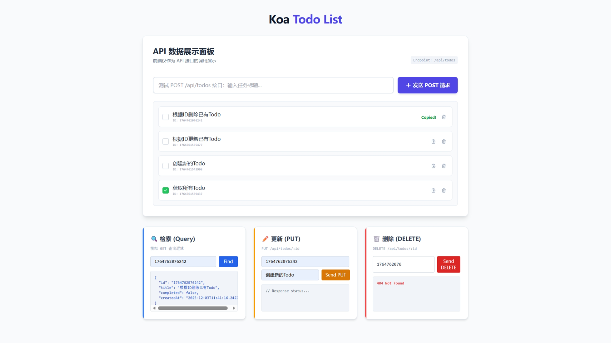

<div align="center">



----

# 🚀 Koa Todo List

**一个基于 Node.js + Koa2 框架构建的轻量级 RESTful API 服务端项目。**
演示了从路由定义、中间件机制到原生文件系统数据持久化的完整后端开发流程。
前端界面采用原生 JavaScript + Tailwind CSS 构建，作为 API 的可视化调用与管理面板。
</div>

---

## ✨ 项目特性

* **轻量级架构**：零外部数据库依赖，使用 Node.js 原生 `fs` 模块实现 JSON 文件数据库，开箱即用。
* **RESTful 规范**：严格遵循 HTTP 动词 (GET, POST, PUT, DELETE) 与状态码规范设计接口。
* **数据持久化**：支持服务重启后数据不丢失，自动管理 `todos.json` 数据文件。
* **前后端分离**：后端专注 API 服务，前端通过 Fetch API 进行异步交互。
* **现代化 UI**：集成 Tailwind CSS，提供响应式、交互友好的管理界面。

## ⚙️ 功能实现

本项目实现了完整的 CRUD（增删改查）业务逻辑：

* ✅ **任务管理**：支持创建新任务、获取任务列表。
* ✅ **状态更新**：支持标记任务完成状态，支持更新任务标题。
* ✅ **精准检索**：提供基于 ID 的特定任务查询功能。
* ✅ **安全删除**：支持基于 ID 的任务移除，包含 404 容错处理。
* ✅ **交互反馈**：前端集成了加载状态动画、操作成功/失败反馈及剪贴板复制功能。

## 📂 项目结构

```text
koa-todo-api/
├── public/              # 🎨 前端静态资源 (HTML/CSS/JS)
│   └── index.html       #    API 演示与管理控制台
├── todos.json           # 💾 本地数据库文件 (自动生成/更新)
├── app.js               # ⚡ 后端入口文件 (路由、中间件、逻辑)
├── package.json         # 📦 项目依赖配置
└── README.md            # 📄 项目说明文档
````

## 🚀 快速开始

### 1\. 安装依赖

确保本地已安装 Node.js 环境，在项目根目录下运行：

```bash
npm install
```

### 2\. 启动服务器

```bash
node app.js
```

当终端显示以下信息时，说明启动成功：

```shell
Server is running at http://localhost:3000
```

### 3\. 访问控制台

打开浏览器访问：**[http://localhost:3000](https://www.google.com/search?q=http://localhost:3000)**

您将看到全功能的 API 演示面板，可直接在界面上测试所有 API 接口。

## 📡 API 接口文档

所有接口的基础路径为 `/api/todos`，数据格式为 `JSON`。

| 方法 | URL Endpoint | 功能描述 | 请求参数 / Body | 响应状态 |
| :--- | :--- | :--- | :--- | :--- |
| **GET** | `/api/todos` | 获取全量任务列表 | 无 | `200 OK` |
| **POST** | `/api/todos` | 创建新的任务 | `{ "title": "任务名" }` | `201 Created` |
| **PUT** | `/api/todos/:id` | 更新任务信息 | `{ "title": "...", "completed": true }` | `200 OK` / `404` |
| **DELETE** | `/api/todos/:id` | 删除指定任务 | Path Param: `id` | `204 No Content` / `404` |

### 💻 命令行测试示例 (cURL)

**创建任务:**

```bash
curl -X POST http://localhost:3000/api/todos \
  -H "Content-Type: application/json" \
  -d '{"title": "Koa API Test"}'
```

**更新任务:**

```bash
curl -X PUT http://localhost:3000/api/todos/<YOUR_ID> \
  -H "Content-Type: application/json" \
  -d '{"completed": true}'
```

## 📝 核心代码实现

### 文件持久化 (File Persistence)

不引入庞大的数据库系统，通过封装 `fs.promises` 实现轻量级存取：

```javascript
// 读取数据
async function readTodos() {
    const data = await fs.readFile(DB_PATH, 'utf8');
    return JSON.parse(data || '[]');
}

// 写入数据
async function writeTodos(todos) {
    await fs.writeFile(DB_PATH, JSON.stringify(todos, null, 2));
}
```

### 路由与业务逻辑

使用 `koa-router` 清晰地分离业务动作：

```javascript
router.delete('/api/todos/:id', async (ctx) => {
    // ...逻辑处理...
    if (notfound) {
        ctx.status = 404; // 严格的状态码反馈
    } else {
        ctx.status = 204; // 成功删除无返回内容
    }
});
```
